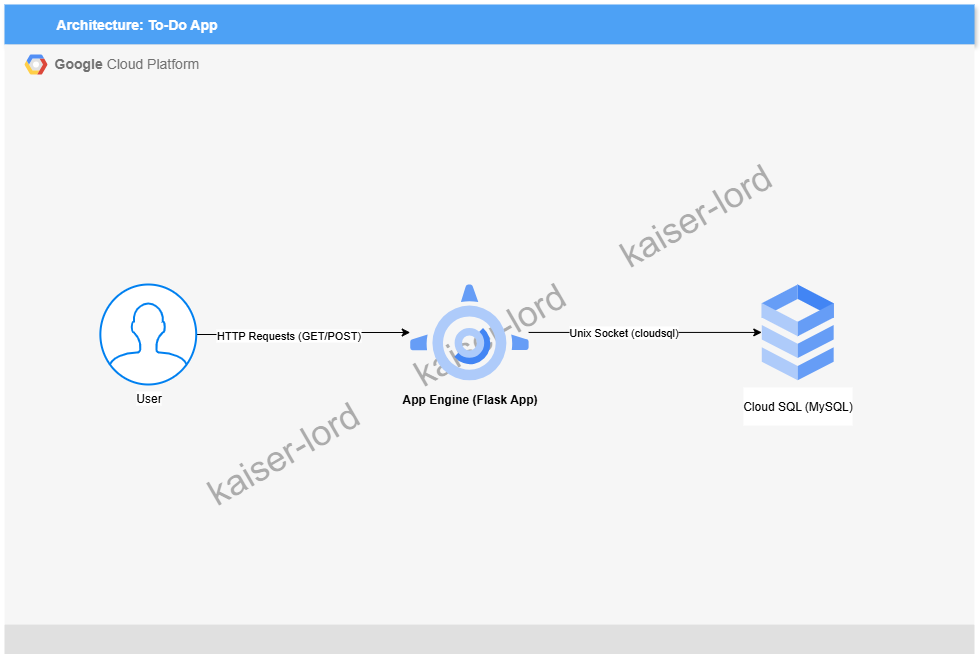

# Simple Web App with Google App Engine and Cloud SQL
*A cloud engineering project by kaiser-lord*

---

## 📘 Overview
This project shows a end-to-end application deployment in the cloud, mimicking more complex, real world web services, using Google Cloud Platform services.

---

## 🎯 Objectives

- Design a simple to do app to showcase Google Cloud Platform knowledge
- Implement Infrastructure as Code 
- Make extensive use of Google Cloud services

---

## ☁️ Architecture
 The application serves a to-do list via Flask on App Engine, storing tasks in a Cloud SQL MySQL database.

- **User**: Sends HTTP requests to add/view tasks via browser.
- **App Engine**: Hosts Flask app, handling requests and rendering UI.
- **Cloud SQL**: Stores tasks in MySQL, connected via Unix socket.

**Components:**
| Layer | Services / Tools | Description |
|-------|------------------|-------------|
| Layer                      | Services / Tools                                      | Description                                      
| **Compute**                | **Google App Engine**, **Gunicorn**, **Flask**        | Web application hosting and runtime environment for the Python app |
| **Database**               | **Cloud SQL (MySQL)**                                 | Managed relational database for persistent data storage            |
| **Application Code**       | **Python**, **Flask Framework**                       | Backend logic and API endpoints for the web app                    |
| **Security / Identity**    | **IAM (Identity and Access Management)**              | Access control and permissions for services and users              |
| **Deployment & CLI Tools** | **Google Cloud SDK (gcloud CLI)**                     | Used for authentication, project setup, and deployment commands    |
| **Networking**             | **App Engine built-in load balancing & HTTPS**        | Automatically handles incoming requests and secure connections     |
| **Monitoring / Logging**   | **Cloud Logging**, **Cloud Monitoring (Stackdriver)** | Tracks logs, errors, and performance metrics of the deployed app   |

---

## ⚙️ Tools and Technologies

- **Cloud Provider:** Google Cloud Platform (GCP)
- **Compute:** App Engine  
- **Database:** Cloud SQL  
- **Programming Language:** Python
- **Web Framework:** Flask
- **Application Server:** Gunicorn
- **Deployment CLI:** Google Cloud SDK (gcloud)
- **Authentication & Access:** IAM roles and service accounts
- **Monitoring:** Cloud Logging, Cloud Monitoring

---

## 🏗️ Implementation Summary

1. Set up the environment: Created a GCP project via the console. Enabled APIs for App Engine (serverless), and Cloud SQL (managed MySQL).
2. Build the app: Used a Python framework, Flask. Created a basic CRUD app (a to-do list) where users can add/view items stored in a database.
3. Integrated database: Provisioned a Cloud SQL instance (MySQL).
4. Deployment: For App Engine, used gcloud app deploy with an app.yaml file.

---

## 💡 Challenges and Learnings
- Learned how to setup correctly GCP resources in Python files
- Learned that when testing in Cloud Shell, Web Preview can be used to test apps there, but port must be modified to match the local server port it is running on
- Solved IAM permission conflicts with App Engine service account that lacked permissions to access Google Cloud Storage Bucket used for staging during deployment

---

## 📈 Results / Outcome
- Deployed infrastructure successfully in local environment for testing
- Moved to App Engine succesfully so it can run in a serverless environment

---

## 🧭 Next Steps / Possible Improvements
- Add autoscaling
- Add basic monitoring via Cloud Monitoring
- Add HTTPS with managed certs

---

## 📫 Contact
**Juan Bautista Sartorio**  
LinkedIn: [linkedin.com/in/juan-bautista-sartorio-isasi](https://www.linkedin.com/in/juan-bautista-sartorio-isasi/)  
GitHub: [github.com/kaiser-lord](https://github.com/kaiser-lord)
